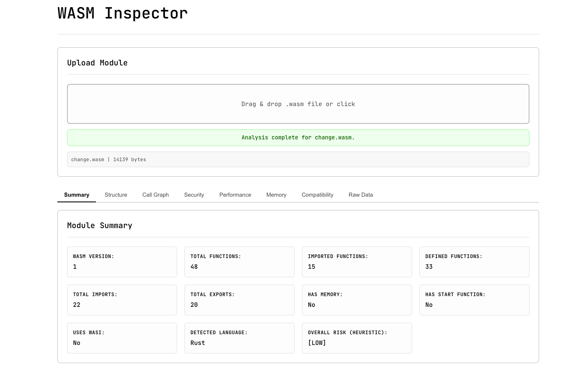
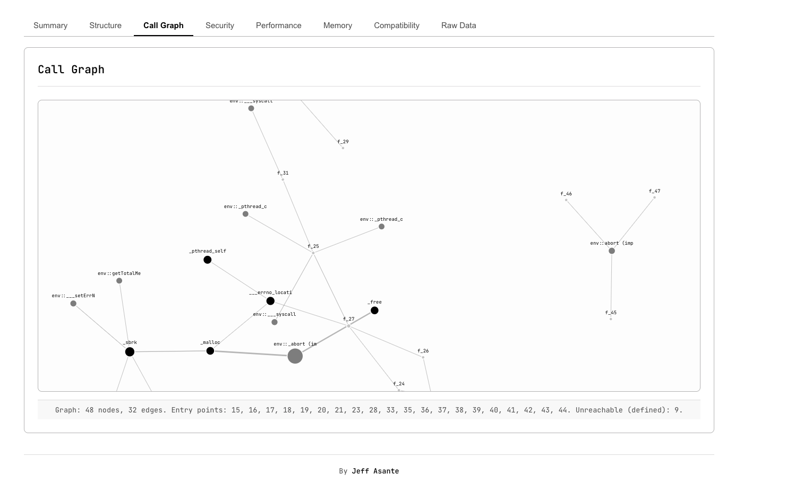
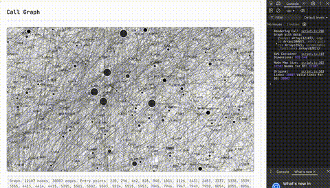

# WASM Inspector

WASM Inspector is a tool designed to analyze and inspect WebAssembly (WASM) modules directly in your browser or via a command-line interface. It provides insights into a module's internal structure, function call relationships, security characteristics, performance metrics, memory usage, and compatibility with various runtimes.

The core analysis engine is written in Rust and compiled to WebAssembly, allowing for efficient client-side analysis in the web UI.


## Screenshots

**Web User Interface:**


**(Optional) CLI / Another Web UI View:**


## Demo (GIF)




**[Live Demo](https://jeffasante.github.io/wasm-inspector/)** 


## Core Features

*   **In-Browser Analysis:** Upload and analyze WASM modules directly in your web browser using a Rust-powered WASM engine.
*   **Detailed Module Parsing:** Extracts information about imports, exports, functions (names, locals, body size), memory, tables, globals, data/element segments, and custom sections.
*   **Call Graph Generation & Visualization:**
    *   Parses function bodies to build actual call relationships (currently supports direct `call` instructions).
    *   Interactive D3.js visualization of the call graph in the web UI.
*   **Dead Code Detection:** Identifies potentially unreachable functions based on the generated call graph.
*   **Memory Analysis:**
    *   Tracks memory operations (load, store, grow, copy, fill).
    *   Identifies common memory allocation patterns.
    *   Provides an analysis of the module's memory layout and basic usage estimates.
    *   Offers memory safety heuristics and optimization suggestions.
*   **Security Insights:**
    *   Detects required module capabilities (e.g., file system access, network interactions via imports).
    *   Identifies common potential vulnerabilities.
    *   Assesses sandbox compatibility for environments like Browsers, Node.js, and Cloudflare Workers.
    *   Analyzes WASI (WebAssembly System Interface) usage.
*   **Performance Metrics:**
    *   Calculates module size and approximate code size.
    *   Provides heuristics for cold start time and module complexity.
    *   Suggests potential optimizations.
*   **Compatibility Assessment:** Checks for potential compatibility issues with major WASM runtimes.
*   **Source Language Detection:** Offers a heuristic-based guess of the original source language (e.g., Rust, C/C++).
*   **Command-Line Interface (CLI):**
    *   Offers summary, detailed textual report, and JSON output formats.
    *   Supports filtering for specific analysis sections.

## Project Status

WASM Inspector is an active project with a functional core analysis engine and a working web UI. The CLI provides an alternative way to access the analysis capabilities.

Key areas of ongoing development include enhancing the detail and interactivity of the web UI, and expanding call graph analysis to include indirect calls.

## Getting Started

### Prerequisites

*   **Rust Toolchain:** Latest stable version recommended (e.g., via [rustup.rs](https://rustup.rs)).
*   **`wasm-pack`:** For building the WebAssembly component for the web UI.
    ```bash
    cargo install wasm-pack
    ```
*   **(Optional) `wat2wasm`:** From the [WABT toolkit](https://github.com/WebAssembly/wabt), useful for converting WebAssembly Text Format (`.wat`) to binary (`.wasm`) for testing.

### Building the Project

1.  **Clone the repository:**
    ```bash
    git clone https://github.com/jeffasante/wasm-inspector.git
    cd wasm-inspector
    ```

2.  **Build the WebAssembly Library (for the Web UI):**
    ```bash
    wasm-pack build --target web --out-dir ./web/pkg --features web
    ```
    This compiles the Rust library to WebAssembly and generates JavaScript bindings in `web/pkg/`.

3.  **Build the CLI Tool (Optional):**
    ```bash
    cargo build --release --features cli
    ```
    The executable will be at `target/release/wasm-inspector` (or `target/debug/wasm-inspector` for dev builds).

### Using the Web Interface (Recommended)

1.  Ensure you have built the WebAssembly library (Step 2 in "Building the Project").
2.  Serve the `web` directory using a local HTTP server. Browsers often restrict loading WASM modules from `file:///` URLs.
    *   Using Python 3:
        ```bash
        cd web
        python -m http.server 8000
        ```
    *   Using Node.js with the `serve` package (install globally via `npm install -g serve` if needed):
        ```bash
        serve web -l 8000
        ```
3.  Open your web browser and navigate to `http://localhost:8000` (or the port your server is using).
4.  Drag and drop a `.wasm` file onto the upload area, or click to use the file selector. Analysis results will be displayed across the different tabs.

### Using the CLI

Navigate to the project's root directory.

**Basic Analysis (Summary Output):**
```bash
./target/release/wasm-inspector ./test-data/change.wasm 
```

**JSON Output:**
```bash
./target/release/wasm-inspector ./test-data/change.wasm --format json
```

**Detailed Textual Output:**
```bash
./target/release/wasm-inspector ./test-data/change.wasm --format detailed
```

**Show only Security Analysis:**
```bash
./target/release/wasm-inspector ./test-data/change.wasm --security-only
```

**Save JSON Output to a File:**
```bash
./target/release/wasm-inspector ./test-data/change.wasm --format json -o analysis_output.json
```

## Technical Overview

The `wasm-inspector` leverages Rust for its core static analysis engine.
*   **Core Library (`src/lib.rs` & modules):** This is where the heavy lifting happens. It uses the `wasmparser` crate for parsing the WASM binary. Custom logic in modules like `analyzer.rs`, `graph.rs`, `memory.rs`, and `security.rs` perform the various analyses.
*   **Compilation to WASM:** For the web UI, this core Rust library is compiled into a WebAssembly module using `wasm-pack` and `wasm-bindgen`. This allows the analysis to run entirely client-side.
*   **Web UI (`web/`):** Built with standard HTML, CSS, and JavaScript. It loads the inspector's WASM module, receives uploaded WASM files from the user, passes the file bytes to the Rust/WASM functions, and then dynamically renders the structured analysis results. D3.js is used for call graph visualization.
*   **CLI (`src/main.rs`):** A native command-line application that uses the same core Rust library. It parses command-line arguments (using `clap`) and outputs analysis results to the terminal.


## License

Licensed under the [Apache 2.0 License](LICENSE-APACHE).
